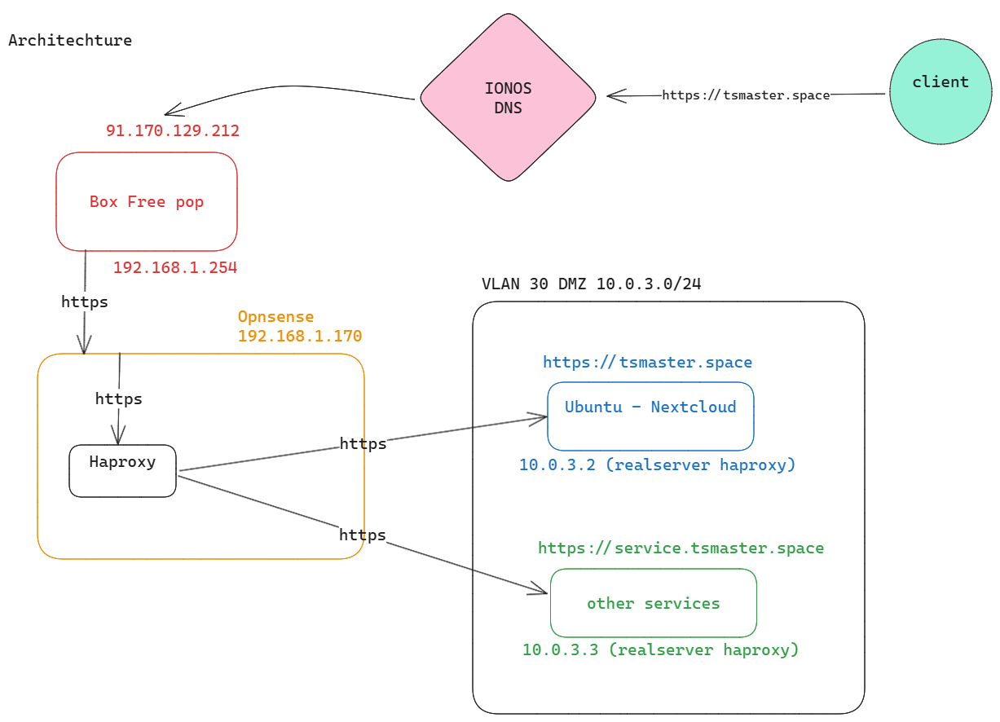

# FYC - NEXTCLOUD

## Global architecture



## Install and configure Opensense

For this example, we are gonna use opnsense as a firewall + reverse proxy ! It's open source, free ti use and super easy to understant when you are not familliar with network configurations

### Opnsense proxmox config

First, download the ISO and upload it to your Proxmox, then create a new VM just like so 👍


Name it as you want


Add your ISO file of the OPNSense and Linux type kernel 6.x the ISO file can be found here :  
<https://opnsense.org/download/>

 Use DVD image to have a .iso then upload it onto your proxmox server ! 


Let SeaBIOS, by default and Default display and i440fx machine type let the default SCSI controller and add Qemu Agent  
- i440fx represent the type of virtual machine but both options works here, we just left default !  
- BIOS SeaBIOS : Default simple bios here, but does not support secure boot but we don’t need it. If you want to enable secure boot, choose the other option UEFI Bios and enable TPM.But mostly not needed on firewalls like this and maybe FreeBSD does’’t support it at all so stay with SeaBIOS as it is easier and the default option.


Add a bit of storage 60 Go should be enough let the SCSI controller by default and no cache


Opnsesne is not very demanding in resources so 2 CPU should be enough and it can run with only one if needed but be careful, all your traffic will goes through this one so we need some performances to get a high internet speed ! Let the x86-64-v2-AES by default


Now add 4Go of RAM, this is a lots but it's needed for the installation (+3Go) but we can lower it afterwards if needed !


Add the network, only one interface for now, we will add a second later just before starting our OPNsense ! Let the defaults, VirtIO controller and vmbr0 default bridged interface  
VirtIO is the default and the most efficient driver here on virtualization for Linux kernels. With windows, if we want to use this driver, we have to install it first cause it is not native. 


Now that's done, uncheck the "start after created" checkbox we need to add a second network interface first


Now go in the new VM section, and add a new network interface, same vmbr0 bridged default interface !

## Opnsense installation

  
We are good to go, now you can start the VM and process the opnsense installation 👍  
Once the VM is started, you should see a login screen, default credentials for OPNSense are : "root" and "opnsesne", but we are gonna install it first, because it's not done yet ! By default, it boots on a temporary tryal mode, so we have to install it to make it permanent.

login with the following credentials to trigger the installation process :  
login : "installer" pass:  "opnsense"

Follow the instructions to install OPNSense, no redundancy so Ex-fat, don't forget to change the default root password before restarting your VM !  
  
Of course if you are setting this up for a company, it is always recommended to use redoundancy in case the firewall breaks or dies. You’ll have saves and recover so you don’t have to reconfigure it after a loss. You cna even push the thing further and have 2 instances of OPNSense with config synchronized to make some load balancing if you have a big infrastructure and you need a lot of speed.

Once it's done, you should have a fresh install for your OPNSense, a default WAN interface should have been created, get your ipv4 address and try <https://opnsense-ip>, you should see a login screen ! Login with your root credentials


Now for security reason, at the moment you add a new LAN network in OPNSense, the default connection to the web interface will shutdown, because you are accessing it from your WAN address which is not recommended ! So be careful, thoses steps are crucial if you don't want to lose access to your OPNSense web interface !

## Create VLANs and LAN interface

First thing to do is to create a VLAN for our nextcloud service ! Well basically, this is a web service accessible publicly, so this service should go in a DMZ, so we are gonna create a DMZ VLAN for our nextcloud VM :  
In Interfaces/Devices/VLAN, add this :


For me, the WAN took vtnet0 so I'll take the vtnet1 to transport my LAN and VLANs !

- The vtnet1 is the second network interface which is not connected already. Our LANs networks will be configured with this interface.
- The vtnet0 is the WAN network interface where internet comes from. 

Once this done, we need to assign a new interface :


in Interfaces/Assignments, look for your VLAN Device and add it as a new interface !  
Then we will configure the interface to create a new VLAN 10.0.3.1/24 with no DHCP server :


Now with this done, we have a new VLAN 10.0.3.1/24

- Why no DHCP ? :  
  For security reasons ! Here this network we have just created will act as our DMZ → the zone where traffic will come from the internet ! So it is an untrusted zone ! We do not allow devices to acquire an IP address automatically cause this could be dangerous. We ‘ll have to control each device we add on this network and make sure no one is being added without us notifying !
- IPV6 ? :   
  In most cases IPV6 is not required inside a local network ! It may allow us to have more IP on our sub network but we don’t need so much addresses ! Maybe on specific cases it will be activated and configured but here there is no need too and IPV4 still much more understandable and easier than IPV6.

## Create Nextcloud Ubuntu VM

I choose to use Ubuntu 24.04 LTS as it's a simple distro all build, with NVIDIA graphic drivers compatibility. It is also recommended by NextCloud to install it on this distro because it's the most documented and used for NextCloud !

But we have some extra config to make :


Choose the Ubuntu ISO you imported on your proxmox, download it and upload it before if not already done !

link to Ubuntu downloads : <https://ubuntu.com/download/server#manual-install-tab>


Now this part changes a bit, select standard VGA for the display method and choose q35 type machine with OVMF UEFI boot part, add Qemu agent and select your desired EFI storage, you can also pre-enroll keys !

- Why q35 :   
  It is the recommended type of machine to support GPU pass through and that’s what we are gonna do here, to have a more fluid desktop experience we can even make some AI later for our NextCloud using the GPU !
- Why OVMF UEFI ? :   
  Same here, we have a Ubuntu Server, wich supports UEFI and secure boot, we can enable it. It also helps for the graphic driver compatibility ! The Bios of the Graphic card is also UEFI so it will only be compatible with UEFI boot systems.


Now be shure to add extra space on this one because it is gonna be your cloud, so basically where all your data will be stored ! Along with the AI models which are not so lightweight ! As long as i have a SSD, i've checked the box SSD emulation, but this depends on your configuration !


Now for the CPU part, i'm gonna be generous, because we'll have clam AV (antivirus for files) running in background with Talk, FullTextSearch which takes 1G RAM and 1 VCPU, if we want to work with AI, it is also recommended to add extra cores if you can !


Same for the RAM, here i put 16 Go because some models doesn't fit in my GPU memory, so it will take space within my RAM ! And we want a smooth nextcloud experience ! But depending on what you want to do with your nextcloud you can adjust theses settings. For a familly usage 5-6 pers max you can have only 4-5 CPU and 6-8 Go RAM.


For the Network here, don't forget to select vmbr0 (the same interface than the LAN on OPNSense) and add the VLAN 30 with no firewall (we run OPNSense on our own). This will tag all the packets going out from the interface with VLAN 30, so OPNSense will detect this and manage the traffic coming from this VM, but we need to configure it first !


Now with this done, you can create and power on your VM !

## NextCloud Ubuntu configuration

In this part we are going trough all the installation of the NextCloud Ubuntu VM !

Install your Ubuntu by following the interactive install, if you need to configure the network because you have taken a network install, just put the ip 10.0.3.2, gateway 10.0.3.1 and /24 ! Your Ubuntu should automatically connect and have access to internet ! If you have internet access issue, you can also configure DNS with 8.8.8.8 or 8.8.4.4 temporally !

once you are logged into your fresh Ubuntu install first update and upgrade it :

```
sudo apt update && sudo apt upgrade -y
```

Then shutdown your VM and add the PCIE GPU device : 


Most of the time, you will have too PCIE devices detected for your graphics card :   
- Video  
- Audio   
Select the one finishing with 00.0 as it is most of the time the video part.

Restart the machine,

then install the NVIDIA driver with the Ubuntu Additional driver tools :


Once the driver installed, reboot one last time and you should be done and you should see this in the NVIDIA X server settings app :


## Install docker

Now I'll just follow the docker documentation and install it on my system :

```
# Add Docker's official GPG key:
sudo apt-get update
sudo apt-get install ca-certificates curl
sudo install -m 0755 -d /etc/apt/keyrings
sudo curl -fsSL https://download.docker.com/linux/ubuntu/gpg -o /etc/apt/keyrings/docker.asc
sudo chmod a+r /etc/apt/keyrings/docker.asc

# Add the repository to Apt sources:
echo \
  "deb [arch=$(dpkg --print-architecture) signed-by=/etc/apt/keyrings/docker.asc] https://download.docker.com/linux/ubuntu \
  $(. /etc/os-release && echo "${UBUNTU_CODENAME:-$VERSION_CODENAME}") stable" | \
  sudo tee /etc/apt/sources.list.d/docker.list > /dev/null
sudo apt-get update

# sudo apt-get install docker-ce docker-ce-cli containerd.io docker-buildx-plugin docker-compose-plugin

# sudo usermod -aG docker tstraub
```

Don't forget to logout and re-login into your account to apply the group changes ! Try docker with :

```
docker ps
```

👍 Docker is now installed on our system !

## Setting up nextcloud your domain name

We are almost done setting up our NextCloud, we now need to install NextCloud via docker AIO which is what they recommend, because it is all in one, and simple to configure ! But ! We are gonna use HAProxy managed from our OPNSense instance, so we need to get rid of the default reverse proxy which is a Caddy by default !  
In their documentation, they specify this URL for a proxy-less install using your own reverse proxy :  
<https://github.com/nextcloud/all-in-one/blob/main/reverse-proxy.md>

According to the documentation the correct command for us to launch NextCloud wil be :

```
sudo docker run \
--init \
--sig-proxy=false \
--name nextcloud-aio-mastercontainer \
--restart always \
--publish 8080:8080 \
--env APACHE_PORT=11000 \
--env APACHE_IP_BINDING=0.0.0.0 \
--env APACHE_ADDITIONAL_NETWORK="" \
--env SKIP_DOMAIN_VALIDATION=false \
--volume nextcloud_aio_mastercontainer:/mnt/docker-aio-config \
--volume /var/run/docker.sock:/var/run/docker.sock:ro \
ghcr.io/nextcloud-releases/all-in-one:latest
```

- \--init : initialize NextCloud for the first time with domain name setup and containers setup
- \--sig-proxy=false : to specify that we don’t want the integrated proxy as we will run our own proxy on OPNSense (HAProxy)
- \--name : to specify the name for the container, i’ve let the default here cause it is already named correctly
- \--restart always : Will restart the container if a fatal error occur, to try fixing things. It will also allow NextCloud Containers to start  on system startup ! Great if you have to plan a maintenance and shutdown the Ubuntu server !
- \--publish 8080:8080 : This is the port to publish for the first install process (and only for the install process). you can change is as you want, but don’t forget to connect the the right port to configure your NextCloud afterwards 
- \--env APACHE_PORT 11000 : This passes an environment variable to the Apache container that will expose our NextCloud. This parameter is important as we will specify this port to our HAProxy to connect to our NextCloud.
- \--env APACHE_IP_BINDING=0.0.0.0 : This is the range of addresses on which our Apache is gonna listen for connections ! 0.0.0.0 means all addresses will be allowed to request and use our NextCloud. Here we could have set 10.0.3.1 which is the address of our firewall and HAProxy. This would have only allowed the HAProxy and firewall to access our NextCloud which is a good practice cause all the connections to our NextCloud will first go through our firewall ! But in order not to complicate things i’ll let 0.0.0.0 here. So if i want to change my sub-net i don’t have to restart my NextCloud with the modified address. Plus We are already behind a firewall so this is extra security we can let on the side. 
- \--env APACHE_ADDITIONAL_NETWORK : Same as the previous parameter, if you want to add 2 different precise sub-nets !
- \--env SKIP_DOMAIN_VALIDATION=false : Set to true, this will bypass the domain validation and you’ll have access to an insecure HTTP NextCloud. This really useful when you want to test it or if you don’t have a domain name already or if you just wan to use it locally at your house with no public access ! We will let it to false here as we want to open it publicly and add a domain name to use it !
- \--volume : Thoses parameters sets the default volumes for the NextCloud config persistence, let the default parameters to avoid conflicts and errors ! The volume “docker.sock:ro” specify a socket connection in read-only (:ro) This will allow NextCloud to deploy new applications and integrations via our docker really easily. This is called ExApps (ExternalApps) it is also needed for AI local integration ! But be careful as we are opening our docker socket, this implies security questions ! Be careful of what applications you are installing, i recommend to only use verified apps or to make a code review yourself before installing anything !

You can also add an extra

```
--env EXTERNAL_STORAGE="/mnt/usb" \
--volume /mnt/usb:/mnt/usb
```

If you want to connect a local storage like a USB mounted volume into your NextCloud ! You can configure access to it afterwards with the external storage plugin !  
'“/mnt/usb” should be your local Ubuntu server mounted device ! If you have an external HDD you would like to use on NextCloud, you’ll have to pass it first to the proxmox VM config by adding USB raw device. Then you’ll have to mount it on Ubuntu with the mount command ! Be sure you can access your files before specifying this extra param !

enter this command and your NextCloud server will start at <https://localhost:8080> for the initial setup configuration !

First you'll have to **save your secret passphrase**, don't forget to write it down !

Then NextCloud will ask you for your domain name in order to connect to it and use your own certificate and DNS, but we first need to configure a new Domain name for our NextCloud and we need to configure the reverse proxy in OPNSense !

## Configure domain and HTTPS

I'll be using IONOS to buy and manage my domain name server, but you can use whatever domain name provider you like !

I've bought a new domain name tsmaster.space to host our NextCloud :


now I'm gonna configure it to point to my public so let's change the DNS records for AA and AAAA wich is the default web configuration for a DNS :


Perfect now let's manage our certificate :


We can see here that the validation uses the DNS to register itself so we are gonna use this in OPNSense + HAProxy

### DNS validation how it works ?

Here is a little schema of how DNS validation for a domain name usage with HTTPS is working :


  
Benefits :

- Automatic Domaine Name validation
- Automatic certificate renewing every 60 days no manual actions needed

### ACME configuration

First, check if you don't have any update for your OPNSense :


If you have some, update it and restart if needed, always keep your firewall update when exposing on the internet !

the go to the "Plugin" section

System > Firmware > Plugins

Check community plugins on the right side.


Install the HAProxy plugin and the ACME client plugin, we are gonna use ACME to make the domain check validation ! Enable the plugin in it’s settings and create a ACME account with a valid email and register it here :


First we need to activate the ACME Client Plugin and to enable HAProxy integration // add capture

Then add a new challenge type DNS :  
For IONOS, i got a key from the API management <https://developer.hosting.ionos.com/>

You can add a key here and use the API key in OPNSense


Last step is to add a new certificate in the certificates section like so :  
Just use the ACME account and Challenge type you've just created


Then click on ISSUE/RENEW all certificates to start the validation process ! This will go and check with your API key that your domain is configured and it will validate the certificate via DNS.

Once we've done this, you should see your certificate appearing :


It should be validated too !

### HAProxy configuration

//little reminder reverse proxy, how it works, add schema

First we need to enable HAProxy :


Then add a real server into the real servers section , the real server is the physical server on which the request is gonna be redirected ! You can totally add multiple servers for the same service to make a load balancing web service !


Add 2 servers :

10.0.3.2 for your NextCloud which is our VM

127.0.0.1 for the ACME validation challenge which is our OPNsense (automatic and should appear already)


The default NextCloud AIO docker uses the port 11000 to connect HTTPS as we can see in the docker ps command 👍

```
tstraub@tstraub-ubuntu-master:~$ dps #(docker ps)
nextcloud-aio-apache	5dabfd3b6d17	Up 21 hours (healthy)	80/tcp, 0.0.0.0:11000->11000/tcp
...
```

Now we need to create some back-end pools, add one for NextCloud and one for ACME is created automatically. Set the Layer to HTTP and set the real server to the one created above for your NextCloud


Add 2 conditions :  
1 for the nextcloud matches host tsmaster.space

1 for the acme client (automatic)


Finally add some rules :


Finally add a public front :

Set a listening address for the front, in order to get the http and https connexions, we are gonna user thoses ports on the public WAN interface of our opnsense ! so 192.168.1.170:443 We could also create a redirection rule from http to https for this nextcloud server ! (We'll do it later)


You'll have to create the rules first before adding them !


Now last part, we have to redirect the 443 requests comming into our Box to our opnsense so let's add a redirect rule into our Box :

First change the default web access ports for your Box :


Then create a redirect rule for 443 and 80 ports, redirect to Opnsense !


You'll have to change the opnsense default web ui port too ! It can not be 443 anymore since we are gonna use it for our reverse proxy !

In System/Settings/Administration change the web port to 8443 too !


Now we are good to go !

## Configure nextcloud

Now we are finished with the https certificates validations and DNS register, now we can go back to our nextcloud install and we can reenter the domaine tsmaster.space and we can submit the domain with the blue button ! If everything is configured correctly, you should have a green success message and access to the container managment screen !

https://localhost:8080/containers

On this new page, you can configure the containers to add , download and run with your nextcloud instance ! You can comehere and change that every time you need !

Select the containers you want to install :


I recommand thoses ones + somes other usefull community containers :


Once you've selected your containers to install and start, don't forget to validate and deploy them. Once this step is done, you should see an invation link to your new nextcloud !

But ! We don't have any credentials by default so we are gonna change the default password for the admin user :

On your terminal on the Ubuntu Nexcloud VM :

```
docker exec -it nextcloud-aio-nextcloud bash 
# exec bash inside nextcloud container
php occ user:resetpassword admin
```

Then type the new password 2 times ! You can now connect into your nextcloud with the default admin account !

## Recap

So now we have :  
Acces to the Box : change to 8443 port (https://192.168.1.254:8443

Access to the opnsense : change to 8443 port (<https://10.0.3.1:8443>)

Access to our nextcloud at <https://tsmaster.space>